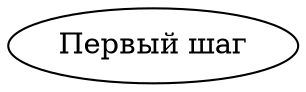
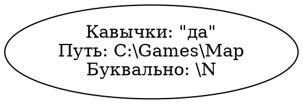
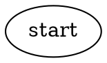
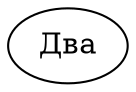
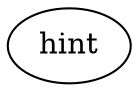
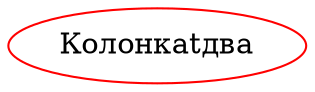
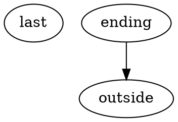

# Формат графовых заметок

Этот документ задаёт полный контракт исходного текста графовой заметки. Он
предназначен в том числе для агента, который генерирует граф без доступа к коду
проекта. Формат — ограниченное подмножество DOT с семантикой приложения; это не
произвольный Graphviz DOT.

## Что именно нужно вывести

Исходник графа — обычный текст, начинающийся с `digraph` и заканчивающийся
закрывающей `}`. Если потребителю нужен готовый исходник, возвращайте только этот
текст: без Markdown-блока кода, без JSON, YAML, пояснений и служебных
полей. Канонический результат заканчивается сразу после последней `}`. Парсер
также допускает после неё пробельные символы и комментарии, но не `;`, второй
граф или другие токены.

В документации ограждённые блоки с меткой `dot` используются только для показа примеров. В
хранилище тот же исходник целиком лежит в существующем поле `bodyMarkdown`, а
метаданные заметки содержат `format: graph`. Расширение исходного файла остаётся
`.md`. Не добавляйте в граф `format`, версию формата или другие метаданные:
парсер их не поддерживает.

Пустая строка и строка только из пробелов или комментариев допустимы и означают
пустой граф. Для генерации предпочтительнее явный `digraph {}`.

## Синтаксис

Документ содержит не более одного направленного графа:



После `digraph` можно указать имя графа: `digraph route { ... }`. Это имя нужно
только синтаксису и не становится заголовком; видимый заголовок задаёт корневой
`label`. Внутри тела разрешены:

- атрибуты текущего графа или группы;
- явные объявления узлов;
- именованные блоки `subgraph`;
- направленные связи `->` и цепочки связей;
- комментарии `// до конца строки` и `/* до закрывающего маркера */`.

Ключевые слова `digraph`, `subgraph` и служебное `graph` распознаются без учёта
регистра. Имена атрибутов и все их значения чувствительны к регистру: `label` и
`state=done` допустимы, а `Label` и `state=Done` — нет. Идентификаторы также
чувствительны к регистру, поэтому `step` и `Step` различаются.

Точка с запятой между операторами необязательна. В списке атрибутов соседние
пары можно разделять запятой, точкой с запятой или только пробелом; один
завершающий разделитель перед `]` также допустим. Для однозначной генерации
используйте запятые между атрибутами и `;` после каждого присваивания,
объявления узла и связи. Для одного узла или одной цепочки допускается не более
одного блока `[ ... ]`.

`strict`, ненаправленная связь `--`, HTML-синтаксис метки `<...>` и несколько
последовательных блоков атрибутов у одного узла или одной цепочки не
поддерживаются.

### Идентификаторы и строки

Не заключённый в кавычки идентификатор имеет одну из форм:

- буква Unicode или `_`, затем ноль или больше букв Unicode, цифр Unicode или
  `_`;
- десятичное число: целое, `12.`, `12.5`, `.5`, а также такая форма со знаком
  `-`.

Остальные идентификаторы нужно заключать в двойные кавычки, например
`"first step"`, `"a:b"` или `"path-one"`. Кавычки разрешены и для обычных
идентификаторов и значений enum. Имена `digraph`, `graph`, `subgraph`, `node`,
`edge`, `strict` в любом регистре зарезервированы и как идентификаторы допустимы
только в кавычках: `"node"`.

Один идентификатор нельзя объявить дважды. Имена узлов и групп находятся в
общем глобальном пространстве: узел и группа тоже не могут иметь одинаковое
имя. Объявления и ссылки сопоставляются по уже декодированному значению строки.

В строке в двойных кавычках поддерживаются ровно три escape-последовательности:

| Исходник | Значение |
| --- | --- |
| `\"` | двойная кавычка |
| `\\` | обратная косая черта |
| `\n` | перевод строки |

Фактический перевод строки внутри кавычек тоже принимается. Другие JSON- или
языковые escapes не поддерживаются: нельзя использовать `\t`, `\r`, `\u1234`,
`\x20`, `\/` и подобные формы. Unicode записывается непосредственно. Текст
`label` и `subtitle` всегда буквальный: приложение не интерпретирует в нём
Markdown, HTML, Graphviz-подстановки или escape `\N`.



## Атрибуты и значения по умолчанию

Атрибуты не наследуются. У корневого графа, каждой группы, каждого узла и каждой
связи собственный набор. Блоки настроек по умолчанию `node [...]` и `edge [...]`
запрещены. Повтор одного атрибута в пределах его объекта — ошибка, в том числе
если одно значение задано прямым присваиванием, а второе через `graph [...]`.

| Область | Допустимые атрибуты | Значение по умолчанию |
| --- | --- | --- |
| Корневой граф | `label` — видимое название заметки | заголовка нет |
| Группа | `label` — видимый заголовок; `kind=group\|section`; `layout=flow\|grid` | заголовка нет; `kind=group`; `layout=flow` |
| Узел | `label`; `subtitle`; `kind=normal\|special\|milestone\|note`; `task=true\|false`; `state=todo\|doing\|done` | `label` равен идентификатору; подзаголовка нет; `kind=normal`; `task=true`; `state=todo` |
| Связь | `label` — буквальная подпись | подписи нет |

На корневом уровне разрешён только `label`. В группе её атрибуты можно записать
прямо или в единственном/нескольких служебных списках `graph [...]`:

```dot
digraph {
  graph [label="Маршрут"];
  subgraph chapter {
    label="Глава";
    graph [layout=grid];
    opening;
    finale [kind=milestone];
  }
}
```

Узел без `task=false` является задачей независимо от `kind`; например,
`kind=note` сам по себе не делает его информационным. Узел `task=false` не имеет
авторского состояния, поэтому атрибут `state` вместе с ним запрещён. Его не
считают в прогрессе.

`kind` и `layout` — семантические подсказки приложению. Они не открывают доступ
к стилям Graphviz. Цвета, формы, координаты, размеры, отступы, классы, шрифты,
URL, изображения, порты, HTML-метки, `rankdir` и другие неподдерживаемые
атрибуты запрещены.

Выбирайте `kind` по смысловой роли узла, а не ради произвольного цвета:

| `kind` | Семантическое назначение | Представление приложения |
| --- | --- | --- |
| `normal` | обычный шаг или задача | нейтральная карточка |
| `special` | особый, редкий или дополнительный шаг | приглушённое золотое выделение |
| `milestone` | ключевой рубеж или важный итог этапа | синее акцентное выделение |
| `note` | справка, подсказка или вспомогательная информация | приглушённая карточка |

Вид узла не определяет участие в прогрессе. Например, `kind=note` остаётся
задачей, пока отдельно не указано `task=false`.

## Группы, секции и порядок

Каждая группа обязана иметь имя: `subgraph group_id { ... }`. Анонимный
`subgraph` запрещён. Группа может содержать узлы и другие группы; каждый узел и
вложенная группа принадлежат ровно одному непосредственному контейнеру.
Порядок непосредственных детей совпадает с порядком их объявлений.

Обычная группа `kind=group` может быть без `label`; её технический идентификатор
не показывается как заголовок. `layout=flow` размещает содержимое по связям.
Простая направленная цепочка автоматически идёт слева направо, если карточки
обычного размера и промежутки целиком помещаются во внутреннюю ширину контейнера;
иначе она остаётся вертикальной. Это работает и для связанных корневых узлов,
и внутри групп/секций; вложенные отступы учитываются. Цепочки со связями с
подписями (включая связи за границы контейнера) сохраняют вертикальное размещение,
чтобы оставить место под текст. Ветвления, циклы и самоссылки сохраняют обычный
поток. Переключение состояния задачи не меняет расположение.
`layout=grid` размещает непосредственных детей в авторском порядке в сетке до
трёх колонок. Эти значения не задают конкретные координаты.

Секция `kind=section` разрешена только непосредственно в корне графа и требует
непустой после удаления пробелов `label`. Она занимает отдельную полную строку и
рисуется без окружающей карточки или рамки. Секция может содержать обычные узлы
и группы, но сама не может быть концом связи.

Независимые корневые компоненты приложение упаковывает в авторском порядке не
более чем в две колонки. На узких экранах число колонок уменьшается, подписи
переносятся, а структура, принадлежность и порядок сохраняются. Визуальные
цвета, геометрия и интервалы принадлежат приложению, а не исходному формату.

Автоматические переносы подписей узлов, подзаголовков, групп и связей балансируют
длину строк без добавления лишних строк. Слово с числовым суффиксом сохраняется
на одной строке, если связка помещается. Явные переносы, в том числе пустые
строки, сохраняются. Неразрывные пробелы сохраняют помещающуюся связку;
слишком длинное слово делится только между графемами. Нового синтаксиса нет.

## Связи

Узлы объявляются явно; ссылка в связи не создаёт узел. Концы связи могут
ссылаться вперёд и находиться в другом контейнере. Проверка выполняется после
чтения всего документа.

`a -> b -> c [label="далее"]` создаёт две связи: `a -> b` и `b -> c`. Подпись
цепочки копируется в каждую из них, и обе учитываются в лимите. Допустимы циклы,
самоссылки, параллельные связи и несвязанные компоненты.

Концом связи может быть обычная непустая группа. Такая связь приходит к границе
контейнера и не разворачивается в набор связей с детьми. Группа считается
непустой, если среди её потомков есть хотя бы один узел; информационный узел
`task=false` тоже подходит. Одной вложенной иерархии пустых групп недостаточно.

Запрещены связи:

- с необъявленным концом;
- с секцией;
- с пустой группой;
- между группой и любым её прямым или косвенным потомком в любом направлении.

Связь от узла внутри одной группы к внешнему узлу или к другой группе допустима.

## Состояние и прогресс

Состояние хранится только в атрибуте `state` узла-задачи. У группы, секции и
корневого графа атрибута состояния нет. Приложение каждый раз вычисляет прогресс
контейнера по всем задачам среди его потомков:

| `state` | Значение |
| --- | --- |
| `todo` | задача ещё не выполнена |
| `doing` | задача начата или выполнена частично |
| `done` | задача выполнена |

- `done`, если задач хотя бы одна и все имеют `state=done`;
- `doing`, если есть выполненная задача или хотя бы одна задача в `doing`;
- `todo` в остальных случаях.

В числитель выполненных задач попадают только узлы `state=done`; узел
`state=doing` даёт контейнеру промежуточное состояние, но добавляет **0** к числу
выполненных.

Пустые и состоящие только из информационных узлов группы не получают прогресс
`0/0`. Связи не означают зависимость: они не блокируют и автоматически не
выполняют задачи. При интерактивном изменении приложение редактирует или
добавляет `state` в исходник узла; вычисленное состояние группы в текст не
записывается.

## Ограничения

| Ресурс | Максимум | Как считается |
| --- | ---: | --- |
| Весь исходник | 100 KiB | байты UTF-8, то есть не число JavaScript-символов |
| Узлы | 300 | все объявления узлов |
| Связи | 600 | каждое звено цепочки отдельно |
| Группы | 50 | все `subgraph`, включая секции |
| Вложенность групп | 8 | корневая группа имеет уровень 1; сам `digraph` уровнем не считается |
| Каждый `label` и `subtitle` | 500 символов | Unicode code points; составной grapheme может занимать несколько |

Лимиты включительны. Превышение вызывает ошибку; обрезания нет. Ограничение
подписи относится к корневому графу, группам, узлам и связям. Если у узла нет
`label`, лимит также проверяется для текста его идентификатора, ставшего
подписью.

## Полные примеры

Минимальный граф:



Более насыщенный пример показывает вложенную сетку, связь с границей группы,
две самостоятельные карточки и финальную секцию без карточки:

```dot
digraph route_map {
  label="Карта пути";

  subgraph opening {
    subgraph opening_grid {
      layout=grid;
      clue [label="Найти подсказку", state=done];
      key [label="Получить ключ", subtitle="Северный зал", kind=special];
      gate [label="Открыть ворота", kind=milestone, state=doing];
      clue -> key -> gate [label="затем"];
    }
  }

  subgraph crossing {
    label="Переход";
    scout [label="Осмотреть путь"];
    marker [label="Ориентир", kind=note, task=false];
  }
  opening -> crossing [label="ведёт к"];

  subgraph story_one {
    label="Первая история";
    first_a [label="Начало"];
    first_b [label="Финал", kind=milestone];
    first_a -> first_b;
  }

  subgraph story_two {
    label="Вторая история";
    second_a [label="Встреча"];
    second_b [label="Развязка"];
    second_a -> second_b;
  }
  scout -> story_one;

  subgraph extras {
    label="Самостоятельные эпизоды";
    kind=section;
    layout=grid;
    extra_one [label="Эпизод один"];
    extra_two [label="Эпизод два"];
    extra_note [label="Справка", kind=note, task=false];
  }
}
```

Следующие документы намеренно невалидны.

Повтор объявления и повтор атрибута:



Информационному узлу нельзя задавать состояние:



Неподдерживаемый escape и стиль:



Секция не может быть вложенной или участвовать в связи:



## Канонический стиль генерации

Парсер принимает больше вариантов записи, чем следует генерировать. Для
стабильного и читаемого результата:

- используйте ASCII `snake_case` для идентификаторов и заключайте их в кавычки,
  только когда это необходимо;
- пишите ключевые слова, атрибуты и enum-значения в нижнем регистре;
- заключайте любой пользовательский текст в двойные кавычки;
- ставьте запятые между атрибутами и завершающую `;` внутри тела графа;
- сначала объявляйте контейнеры и узлы, затем связи, когда это не ухудшает
  локальную читаемость;
- используйте `label`, `subtitle`, `kind`, `task`, `state`, `layout` только по
  их семантике; не пытайтесь кодировать внешний вид.

Это рекомендации, а не дополнительные условия валидности. Например, Unicode-
идентификаторы, ключевое слово `DIGRAPH`, значения enum в кавычках и отсутствие
`;` внутри тела действительно принимаются парсером.

## Краткая инструкция агенту

> Сгенерируй один валидный исходник графовой заметки в описанном формате.
> Верни только сырой текст от `digraph` до финальной `}`, без Markdown-ограждения,
> JSON и пояснений. Объяви каждый узел и именованный `subgraph` ровно один раз,
> сохрани авторский порядок и используй только документированные атрибуты.
> Пользовательский текст заключай в кавычки и экранируй только `\"`, `\\`, `\n`.
> Не добавляй стили, неявные узлы, состояние групп, версию или метаданные.
> Перед ответом проверь уникальность идентификаторов, концы всех связей,
> ограничения секций и групп, `task=false`, лимиты и закрывающие скобки.

Контрольный список перед выдачей:

1. Результат — один `digraph` и ничего после его `}`.
2. Все узлы и группы объявлены ровно один раз; зарезервированные ID взяты в
   кавычки.
3. У каждого объекта только допустимые и неповторяющиеся атрибуты правильного
   регистра.
4. У `task=false` нет `state`; у групп и секций состояния нет вообще.
5. Все концы связей объявлены; нет секций, пустых групп и пар
   предок/потомок в качестве концов одной связи.
6. Секция находится в корне и имеет непустой `label`.
7. Строки используют только `\"`, `\\`, `\n`; все лимиты соблюдены.

## Необязательная локальная проверка

Из корня репозитория можно проверить внешний файл существующим парсером, не
копируя исходник в командную строку:

```sh
node --import tsx --input-type=module -e 'import { readFile } from "node:fs/promises"; import { parseGraph } from "./src/domain/graph/parser.ts"; const source = await readFile(process.argv[1], "utf8"); parseGraph(source); console.log("valid graph");' -- /absolute/path/to/graph.dot
```

При ошибке команда завершится с диагностикой парсера. В интерфейсе приложения
та же проверка показывает строку и столбец и не позволяет сохранить невалидный
граф.
